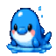

<div align="center">

# Code Pet

### Your Claude Code sessions, but with a dog.

[](#license)
[](#requirements)
[](https://docs.claude.com/en/docs/claude-code)
[](https://github.com/mradovic95/code-pet)

<!--
  HERO VIDEO — to be added. See assets/docs/README.md for what to produce.
  Once recorded, replace this block with:
  <video src="<uploaded-url>.mp4" autoplay loop muted playsinline width="720"></video>
-->

&nbsp;&nbsp;

&nbsp;&nbsp;


<sub><em>Idle · Working · Waiting for action</em></sub>

</div>

---

## Why Code Pet?

- **Company for long sessions.** Hours with an AI feel less lonely when
  something in the corner is keeping you company.
- **Glanceable state.** Know at a glance whether Claude is working, stuck on
  a permission prompt, or done — without switching windows.
- **Zero friction.** Fully transparent, click-through, always-on-top. It
  never steals focus and never interrupts your flow.

## Install

**1.** Add the marketplace (one-time):

```
/plugin marketplace add mradovic95/code-pet
```

**2.** Install the plugin:

```
/plugin install code-pet
```

**3.** Run `/reset` or start a new session so Claude picks up the new hooks.

That's it. Electron is installed in the background on first run (~85 MB),
so the pet appears instantly on every session after.

To uninstall:

```bash
claude plugin remove code-pet
```

## Meet the pets

<div align="center">

|  |  |  |  |  |
|:---:|:---:|:---:|:---:|:---:|
| **Dog** | **Cat** | **Panda** | **Dolphin** | **Bird** |

</div>

Want your own? Drop a sprite sheet into `assets/pets/` — see
[docs/sprites.md](./docs/sprites.md).

## How it works

Code Pet listens to [Claude Code hooks](https://docs.claude.com/en/docs/claude-code/hooks).
Each hook translates into a semantic event, which drives the pet's state and
animation.

```
Claude Code hook (stdin JSON)
   ↓
hooks/scripts/*.js  →  HTTP POST /event
   ↓
event server  →  per-project state machine
   ↓
IPC → renderer  →  CSS sprite animation plays
```

### Hook → state → animation

<sub>(Dog shown as the canonical example. Every pet has its own sprite set
for each state — see <a href="./assets/docs/pets/">assets/docs/pets/</a>.)</sub>

| Claude Code hook | What the pet does | State | Animation |
|---|---|---|:---:|
| `SessionStart` | Wakes up with a one-shot greeting, then settles | `idle` |  →  |
| `UserPromptSubmit` (normal) | Gets to work | `working` |  |
| `UserPromptSubmit` (plan mode) | Starts thinking instead of working | `planning` |  |
| `Notification` (permission prompt) | Looks at you and waits | `waiting_for_action` |  |
| `PostToolUse` | Goes back to working / planning | restores previous | *(resumes)* |
| `Stop` | Finishes and rests | `idle` |  |
| `SessionEnd` | Falls asleep and closes the overlay | — | — |

A few subtleties worth knowing:

- **Plan mode is auto-detected** from the `permission_mode` field in the hook
  stdin — no config needed.
- **`SessionStart` is ignored** if a session is already in flight. This stops
  spurious wake-ups after permission prompts.
- **`SessionEnd` only closes the pet from `idle`** — if you're still working
  when the session ends, the pet stays put.
- **`PostToolUse` restores context** — after a permission prompt, the pet
  snaps back to whatever it was doing (`working` or `planning`), not to idle.

The overlay itself is transparent, frameless, always-on-top, click-through,
and never steals focus.

See [docs/hook-table.md](./docs/hook-table.md) for the full hook → event →
state matrix, and [docs/events-and-states.md](./docs/events-and-states.md)
for the HTTP event API.

## Requirements

Node.js ≥ 18 · macOS / Linux / Windows · Claude Code with plugin support

## Documentation

- [**Events and states**](./docs/events-and-states.md) — event server, valid
  events, hook → state mapping
- [**Custom sprites**](./docs/sprites.md) — sprite sheet format, manifest
  schema, adding new pets
- [**Troubleshooting**](./docs/troubleshooting.md) — force-stop, debug logs,
  first-run install issues
- [**Hook table**](./docs/hook-table.md) — complete hook event → pet event →
  state matrix
- [**State diagram**](./docs/state-diagram.puml) — PlantUML state machine

## Contributing

PRs welcome. Open an issue first for anything larger than a small fix —
happy to discuss direction.

## License

MIT
