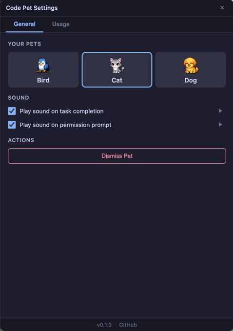
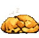
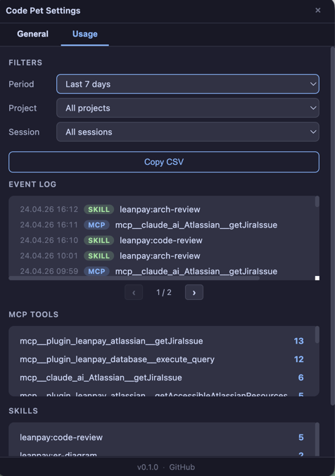

<div align="center">

# Code Pet

### Your Claude Code sessions, but with a pet.

A tiny animated companion that lives in the corner of your screen,
reacts as Claude works, and looks up at you the moment Claude
needs your attention.

_A transparent, click-through Electron overlay driven by Claude Code hooks._

[](#license)

[](https://docs.claude.com/en/docs/claude-code)
[](https://github.com/mradovic95/code-pet/actions/workflows/ci.yml)
[](https://github.com/mradovic95/code-pet)


&nbsp;&nbsp;

&nbsp;&nbsp;


<sub><em>Idle · Working · Waiting for action</em></sub>

</div>

---

**Status:** 0.1.x — early, actively developed. APIs and config may shift between minor versions; pet behavior is stable.

_See [CHANGELOG.md](CHANGELOG.md) for recent changes._

## Why Code Pet?

- **Company for long sessions.** Hours with an AI feel less lonely when
  something in the corner is keeping you company.
- **Glanceable state.** Know at a glance whether Claude is working, stuck on
  a permission prompt, or done — without switching windows.
- **Zero friction.** Fully transparent, click-through, always-on-top. It
  never steals focus and never interrupts your flow.
- **[See what you actually use.](#see-what-you-actually-use)** A private,
  local log of every skill and MCP tool you call — find which ones you
  actually depend on and which you forgot you installed.

## Install

**1.** Add the marketplace (one-time):

```
/plugin marketplace add mradovic95/code-pet
```

**2.** Install the plugin:

```
/plugin install code-pet
```

**3.** Run `/reset` or start a new session so Claude picks up the new hooks.

That's it. Electron is installed in the background on first run (~85 MB),
so the pet appears instantly on every session after.

Having trouble? See [docs/installation.md#troubleshooting](docs/installation.md#troubleshooting).

To uninstall:

```bash
claude plugin remove code-pet
```

## Meet the pets

<div align="center">

|  |  |  |
|:---:|:---:|:---:|
| **Dog** | **Cat** | **Bird** |

</div>

More pets on the way.

## Customize your pet

Double-click the pet to open **Settings**. From the **General** tab you can
switch pets, toggle sounds, or dismiss the pet for this project.

<div align="center">

</div>

## How it works

Your pet watches Claude Code and reacts in real time. Here's what happens in
each moment of a session:

| When you… | Your pet… | Animation |
|---|---|:---:|
| Start a session | Wakes up and settles in |  →  |
| Send a prompt | Gets to work |  |
| Send a prompt in plan mode | Starts thinking instead |  |
| Hit a permission prompt | Looks at you and waits |  |
| Get a reply from Claude | Finishes and rests |  |
| End the session | Falls asleep and closes the overlay | — |

The overlay is transparent, frameless, always-on-top, click-through, and
never steals focus. Plan mode is auto-detected, and the pet stays put if a
session ends while Claude is still working — it only tucks in when you're
truly idle.

## See what you actually use

> 🔒 **Privacy:** All usage data lives only at `~/.code-pet/usage.log`. Code Pet has no telemetry and makes no network calls.

Code Pet keeps a private, local log of every skill and MCP tool you call,
visible in **Settings → Usage** (double-click the pet). Find out:

- which skills you reach for most often
- which MCP servers you actually depend on (and which you forgot you installed)
- a chronological log of every tool call this session

<div align="center">

</div>

The data lives at `~/.code-pet/usage.log` (NDJSON, append-only) and never
leaves your machine. Disable with `USAGE_STORE_TYPE=memory`. See
[docs/usage-tracking.md](docs/usage-tracking.md) for the data format and
a few `jq` recipes to query it.

## Requirements

Node.js ≥ 18 · macOS / Linux / Windows · Claude Code with plugin support

## Contributing

Bug reports and feature requests welcome via [issues](https://github.com/mradovic95/code-pet/issues). Code pull requests are accepted on a case-by-case basis — please open an issue first to discuss. See [CONTRIBUTING.md](CONTRIBUTING.md) for dev setup.

## Acknowledgments

Built with [Electron](https://electronjs.org/) and Node.js. Sprite art by the maintainer.

## License

Source code is [MIT](LICENSE). Art assets (sprites, sounds, animations) are
[proprietary](assets/LICENSE).

---

<div align="center">

⭐ [Star](https://github.com/mradovic95/code-pet) · 🐛 [Report a bug](https://github.com/mradovic95/code-pet/issues/new?template=bug_report.yml) · 💡 [Request a feature](https://github.com/mradovic95/code-pet/issues/new?template=feature_request.yml)

</div>
